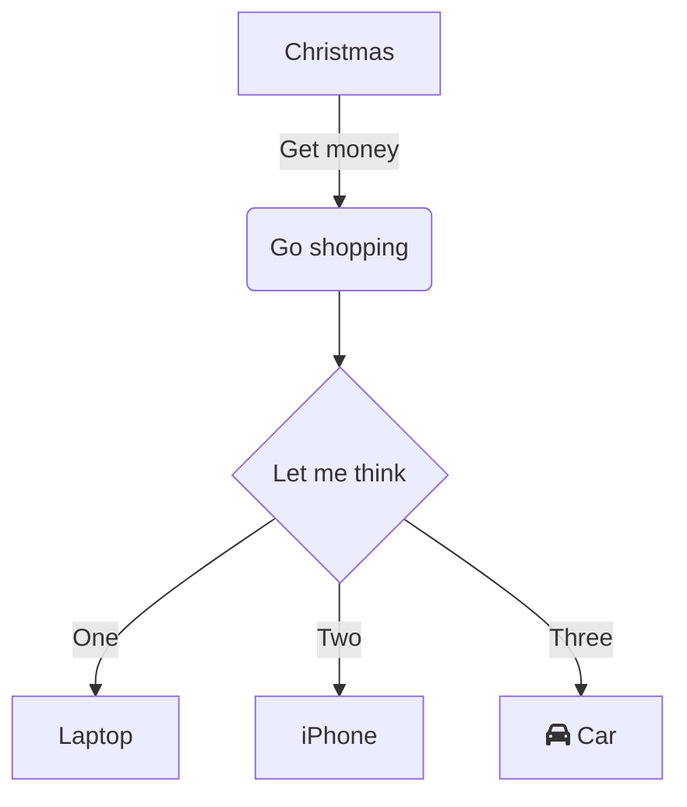
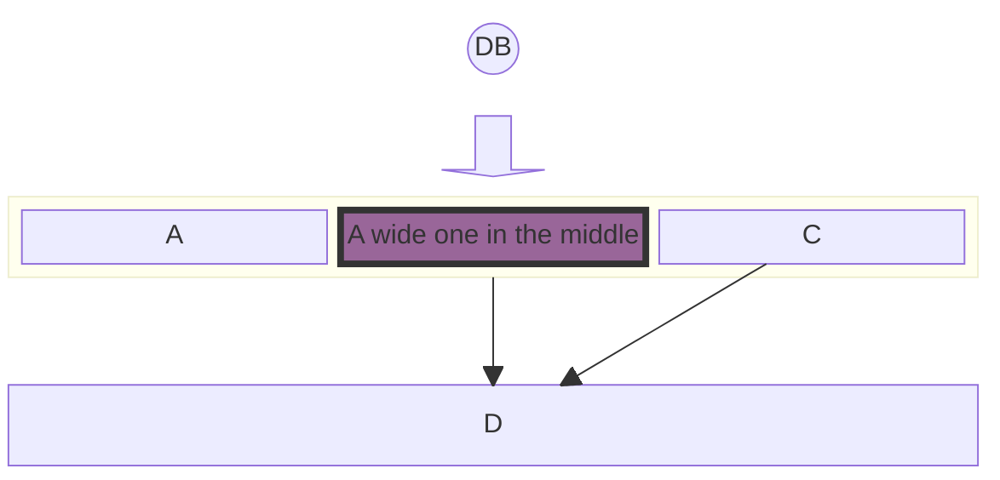
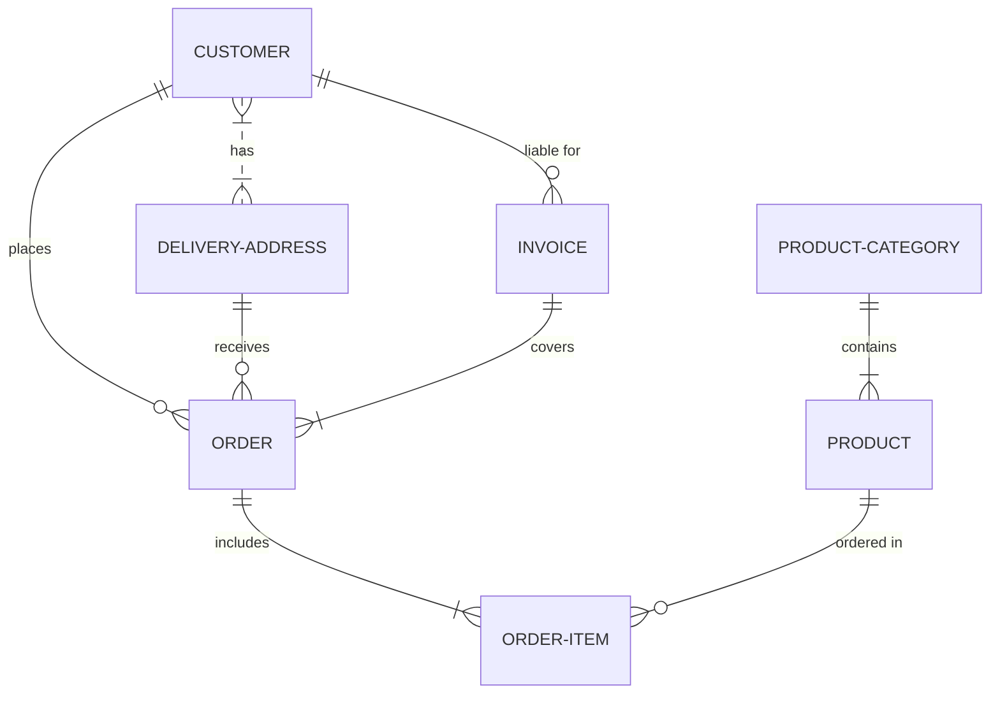

# grammaTest
githubGramaTest

# vllm-ascend issue 处理指南

# 1 问题定位
## 1.1 环境信息检查
- vllm-ascend发布的官方镜像
- vllm-ascend和vllm 版本的配套是否正确
- Ascend的配套是否正确
  -  CANN版本
  -  Torch NPU和Pytorch版本
  -  NPU型号
  -  Driver版本

## 1.2 错误信息查看
- 错误堆栈中初始报错点信息（一般是根因）
  - 其他报错点只是出错后的连锁反应
- vllm-ascend和vllm 版本的配套是否正确
- Ascend的配套是否正确
  -  CANN版本
 
定位过程：
- 已存在问题、历史已处理问题？
  - vllm-ascend和vllm社区搜索问题关键字
  - 组内求助是否有人遇到过
- main分支尝试复现
  - 可以复现
    - 有PR在处理？=》$$\color{改进}$$ $$\color{red}{這是紅色文字}$$
    - 无PR在处理，需要解决 =》报错的相关的代码最近是否有改动，是否是改动导致的？
    - 
  - 无法复现
    - 非问题，问题提出者使用不正确？ =》$$\color{改进}$$
   
    - 

